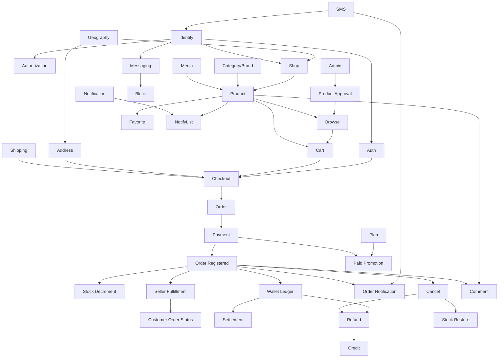

# Feature Dependency Graph

فقط وابستگی کسب‌وکار. بدون Technology. فلش یعنی «نیاز دارد به».

## جدول وابستگی

| Feature | نیاز دارد به | نوع |
|---|---|---|
| Checkout | Cart، Address، Shipping، ورود کاربر | سخت |
| Order | Checkout | سخت |
| Payment | Order (PendingPayment) | سخت |
| Order Registered | Payment موفق | سخت |
| Stock Decrement | Order Registered | سخت |
| Wallet Ledger | Order Registered | سخت |
| Seller Fulfillment | Order Registered، Shop | سخت |
| Customer Order Status | Order | سخت |
| Order Notification | SMS، Order Registered | سخت |
| Product Browse | Product Published (تأیید Admin) | سخت |
| Cancel | Order در Registered یا Confirmed | سخت |
| Refund | Cancel، Wallet Ledger | سخت |
| Credit | Refund یا شارژ (OD-01) | وابسته به تصمیم |
| Settlement | Wallet Ledger، حساب بانکی، Hold period (OD-03) | سخت |
| Comment | Product، Order (اگر فقط خریدار) | وابسته به OD-09 |
| Messaging | Identity | سخت |
| Block | Messaging | سخت |
| NotifyList | Product، Notification | سخت |
| Paid Promotion | Plan، Payment | سخت |
| SEO | Catalog، Product، Shop | نرم |

## ترتیب لازم Phaseها (نتیجه وابستگی)

Identity/Auth → Catalog/Shop/Product → Cart/Checkout/Order → Payment/Wallet → بقیه. با Roadmap Master Prompt سازگار است.
